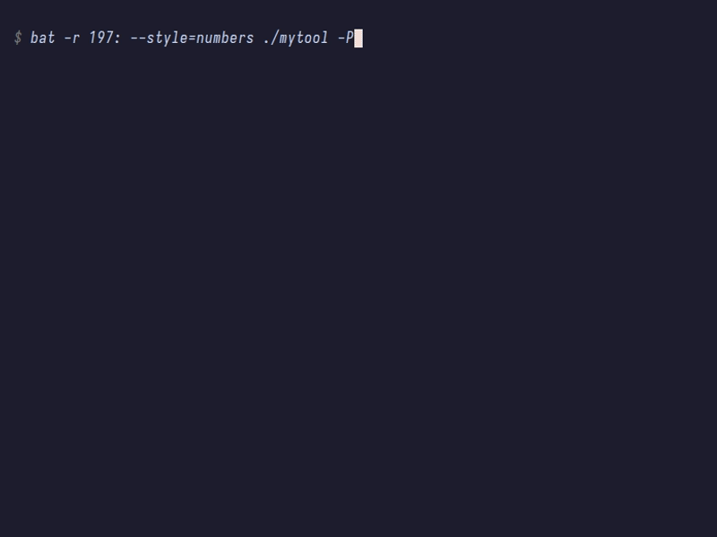

# MonoBash

A minimalist, single-file Bash framework featuring self-documenting magic and BusyBox-style multicall architecture.


## Preview



## Usage

```bash
Usage:
  monobash COMMAND [options...]
  COMMAND [options...]

Options:
  -h --help           Show help information for the specified command

When using monobash directly as COMMAND:
  Usage: monobash <options> [arguments...]
  Options:
    -h --help         Show this help message
    -l --list         List all available commands
    -L --link [DIR=Directory where monobash resides]
        Create symlinks for all commands

Available commands:
    build deploy test (Example commands)
```

## Development

Define a function with `__` prefix to create a command.
Add a `# $$$` comment block to auto-generate its help message.

```bash
# $$$
# Build the artifact.
#
# Usage:
#   ${CMD} [options]
#
# Options:
#   -v, --verbose    Enable verbose output
# $$$
__build() {
    echo "Building project..."
}
```

**Documentation Variables**
Inside the doc block, the following variables are expanded at runtime:

* `${CMD}`: Current command name
* `${SELF}`: Script filename
* `${BOLD}`, `${ULINE}`, `${COFF}`, `${GRAY}`: ANSI formatting codes

## License

[MIT LICENSE](./LICENSE)
